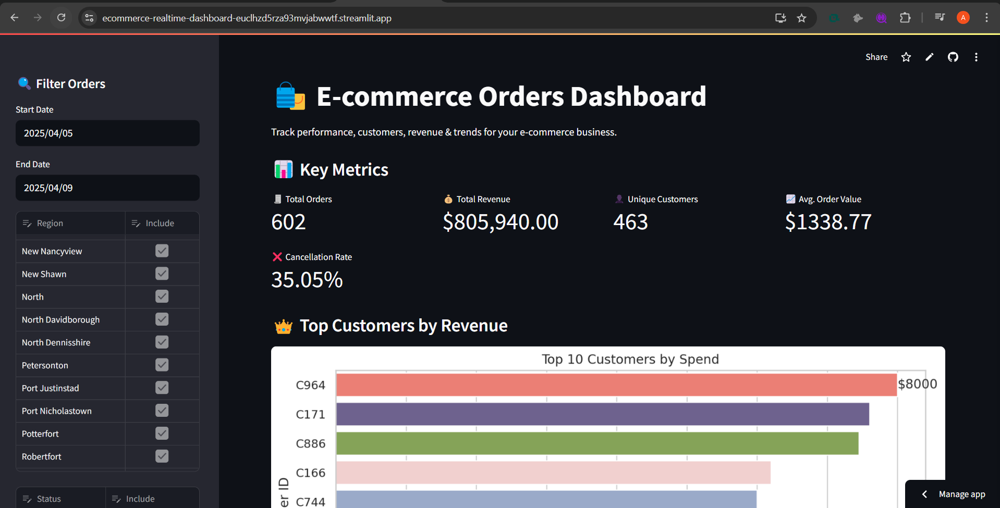
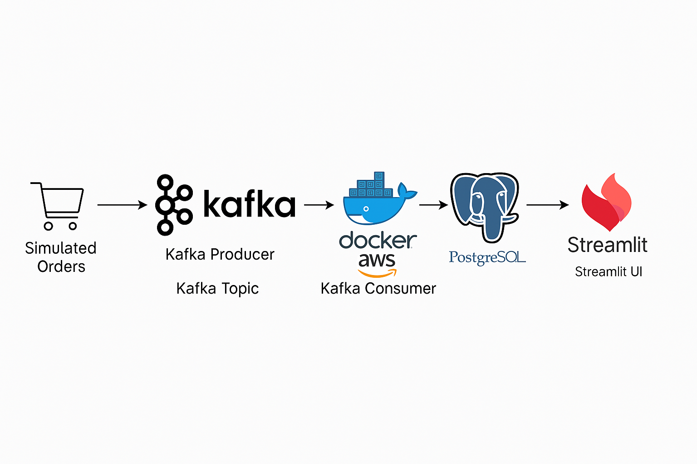

# 📊 E-commerce Real-Time Analytics Dashboard

Welcome to the **E-commerce Real-Time Dashboard** project!  
This project simulates a live order processing system for an e-commerce platform using **Kafka**, **PostgreSQL**, and visualizes real-time insights with **Streamlit**.

---

## 🚀 About the Project

This end-to-end pipeline replicates a simplified e-commerce system where:

- **Kafka** handles real-time order streaming  
- **PostgreSQL (AWS RDS)** stores all incoming order data  
- **Streamlit** displays metrics, KPIs, and insights through a professional dashboard  
- **Docker** is used to orchestrate Kafka and Zookeeper services  

It’s designed for **hands-on learning** and **portfolio-grade demonstration** of modern **Data Engineering + Visualization** workflows.

---

## 🧱 Tech Stack

| Layer            | Tools / Tech                      |
|------------------|-----------------------------------|
| 💡 Data Source    | Python (simulated orders)          |
| 📦 Streaming      | Apache Kafka                      |
| 🛢️ Storage        | PostgreSQL (AWS RDS)              |
| 📊 Dashboard      | Streamlit                         |
| 🐳 Orchestration  | Docker & Docker Compose           |
| 📚 Libraries      | pandas, seaborn, matplotlib, psycopg2 |

---

## 📂 Project Structure

```bash
ecommerce_realtime_pipeline/
│
├── app.py                  # Streamlit dashboard
├── producer.py             # Kafka producer (sends order data)
├── consumer.py             # Kafka consumer (writes to PostgreSQL)
├── create_table.py         # Creates 'orders' table in DB
├── test_db.py              # Verifies DB connection
├── docker-compose.yml      # Docker setup for Kafka & Zookeeper
├── .streamlit/             # Streamlit config & secrets
├── images/
│   ├── dashboard.png       # Dashboard screenshot
│   └── pipeline.png        # System architecture diagram
└── README.md               # This file
```

## 🖼️ Dashboard Preview

<p align="center">
  
</p>

---

## 🧩 System Architecture

<p align="center">
  
</p>


```bash
# 1. Start Kafka & Zookeeper
docker compose up -d

# 2. Create table in PostgreSQL (once)
python create_table.py

# 3. Start the consumer
python consumer.py

# 4. Start the producer
python producer.py

# 5. Launch the dashboard
streamlit run app.py
```
```bash
📈 Future Enhancements
Add login/authentication to dashboard
Add alerting/threshold triggers
Extend to S3 or BigQuery storage
Add chatbot interface (e.g., Ask your orders using LLMs)


🙌 Author
Ankita Singh
🎓 MS in Business Analytics & Information Systems
```
